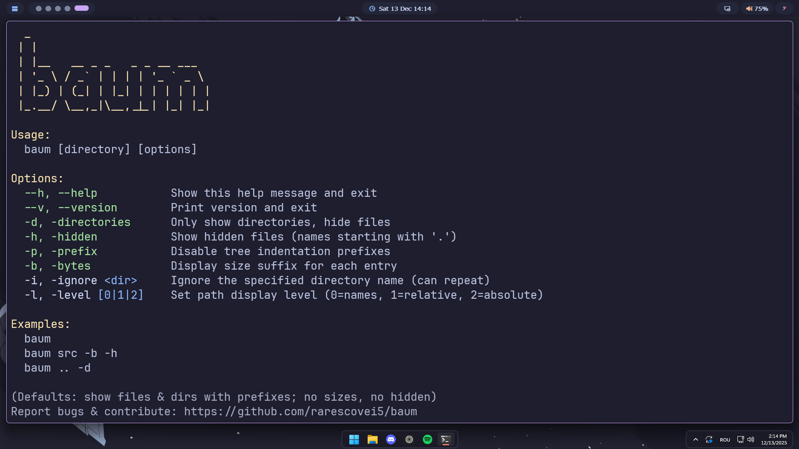

# 🌲 baum

**`baum`** is a lightweight and fast command-line utility written in **Rust** that replicates the functionality of the Unix `tree` command. It recursively prints directory structures in a human-readable tree format.

## 📖 Usage

Once installed, use `baum --help` from your terminal and u should see something like this:

